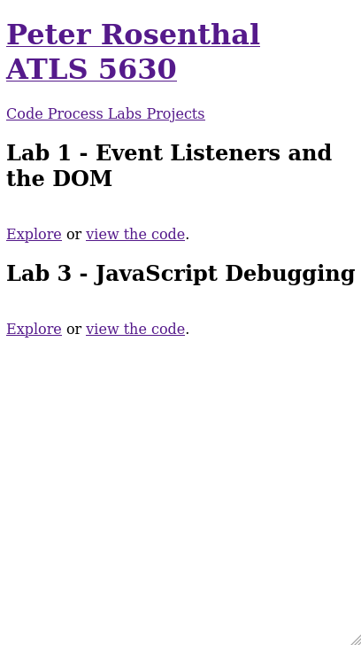
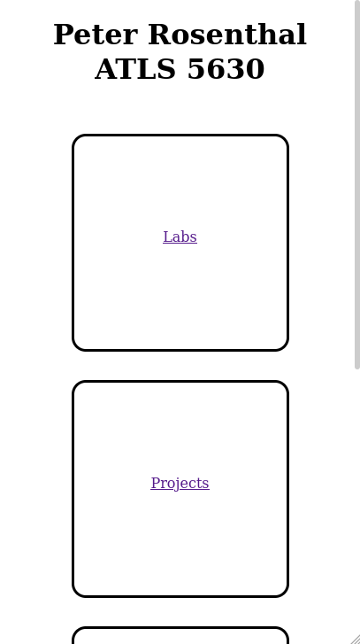
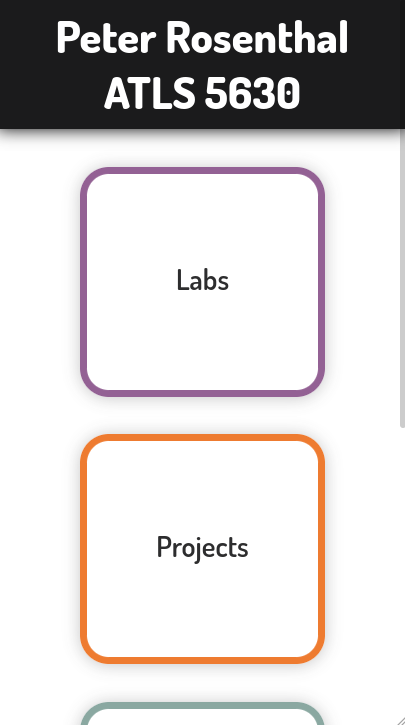
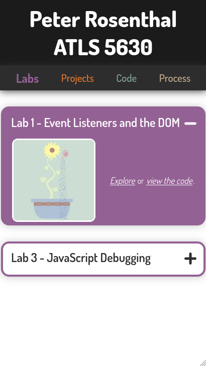
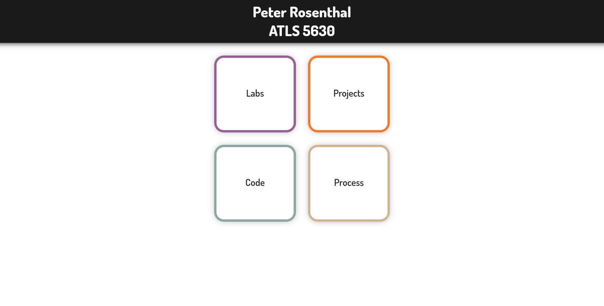
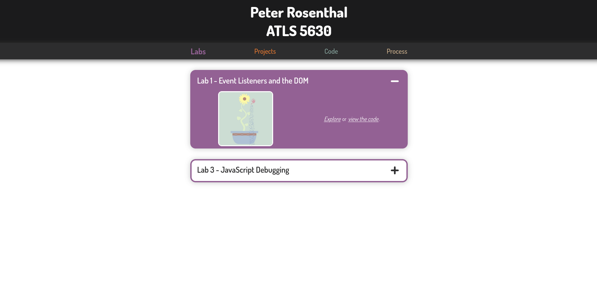

# Class Portal Process
## Milestone 1
The main theme/concept that I want to follow with my portal this time was to have some sort of timeline aesthetics going on. I haven't done a timeline style portal/portfolio before, though I've seen it done a couple times online when looking for inspiration. I think that once the class is finished a timeline is a great way to showcase how my skills have improved throughout the semester. One convenient thing about timelines is that they can be turned vertical and fit on small mobile screens really easily, which allows for the visual design to not be compromised in order to reach responsiveness, the responsiveness is inhernent to the design from the beginning. The first thing I did was create a sketch wireframe to get my concept ideas out onto paper.

This resulted in my first wireframe, which isn't the design I will be going with in the end, but it was still super important and helped me eventually arrive upon my final design.

This first wireframe sketch has a header with my name and the class name on it as well as two buttons, one to my process (these journal style process entries) and one to my code for the class. And then below the header in the main body of the page there is one big timeline that has centered text, but moves the line to the left side for labs and to the right side for projects. This idea was mostly to keep the page looking interesting, but would also serve as a quick way to distinguish between labs and projects. Unfortunately (or fortunately) I went back and read the description for the assignment and saw that a single page portal wouldn't cut it, and I needed separate pages for labs and projects; I couldn't combine them onto one timeline.

So I created a second design, one that needed two wireframe sketches in order to show off the multiple pages of the class portal.

This new design features a header with no links at all other than taking the user back to the landing page if they so desire. But then a secondary nav header that only appears on the labs and project pages, not the landing page. This nav header contains external links to the code and proecess like the first design's header had, but also internal site links to the labs page and the projects page. The landing page has all the same links as the nav header does on not the landing page, but they are spread out to take up the whole page in a grid and have fancy image backgrounds to make them look pretty (I was unable to draw these backgrounds in my sketch). The labs page and the the projects page are identical other than one contains labs and one contains projects, so I only drew a wireframe for the labs page because the same wireframe applies to the projects page as well. These pages contain the timeline like the very first design, but the line sticks to one side because there's no need to differentiate timeline entries anymore. This timeline design also has a feature where the timeline entry being hovered over expands to show a thumbnail of the lab or project to add more fun and interactivity.

One thing that I was not able to communicate with my pen on paper sketches is the colors that the site will be using. For now I want to stick with a light background to the whole site, though maybe a 'dark mode' could be developed and added on later, people love that little switch to go into dark mode. But other than the light background I want very colorful accent lines throughout the page. I'm color deficient and usually find it hard to pick colors myself that look good to both me and normal people, so lately I've been relying on generative color schemes as those tend to work for most everyone. To generate the color scheme for this site, I went to [coolors.co](https://coolors.co/), my favorite color generating site, and just generated away until I felt inspired by something. I then went and modified it very slightly just to make it a little bit more attractive of a color palette, and now these are the colors I'm going to use in the site!

Just one last note on responsiveness: like I mentioned earlier in this proecess entry, the vertical stack that is core to my design makes responsiveness inhernent to the design, and it should look the same, or at least look as intendid no matter the screen size. To really make sure that this happens in practice, not only theory, this is going to be my first site where I actually design for mobile first. Then if there are any changes that I need to make to adjust the design to bigger screens then I can do that, but my goal is to have the two designs (desktop vs mobile) as identical, not only in visuals but also in code, as possible.

## Milestone 2
The first thing I did to start making the class portal website from my inital plans was to just lay out as much of the content as I could with proper links and everything in plain old HTML. One thing I focused on was having as much foresight into formatting and sectioning as I could to help me in the future when I would add CSS and eventually JavaScript. I didn't take a screenshot of the landing page at this time, because it looked identical to the labs page's header and navigation with nothing else added. But I did take a screenshot of the labs page at this time (featured below). You may notice that this screenshot is of a mobile site, and many more throughout the rest of this milstone will be as well. That's because like I said I wanted to try doing in milestone 1: I developed everything about the site for a mobile layout first and then adapted it to work on a desktop site later.

After putting down the content into the site, I had to lay it out and get things formatted correctly. This involved using CSS, but I tried to stay away from getting into any colors and or stylizing and focus mostly on the way things were set up on the page. To keep the format and layout of the adaptable to many screen sizes I used a lot of flex boxes and em sizes for margins and paddings. I intendid on getting a screenshot of both page layouts at this time, the landing page and the labs (projects is identical to labs but different color) page, but it seems like I've lost the screenshot of the labs page, so all I have below is the landing page at this time after formatting. This stage is where the first changes occurred to my design from my original intent. I realized that the various different background pictures to the links on the landing page didn't really fit with my theme, and I realized that I wanted to instead do something with solid colors and rounded corners.

Once I started moving on to thinking about and plannig how I would execute the the aesthetic side of the site, I realized that there were two major technical hurdles to my initial design. The first is that the line part of the timeline would require me to have a line drawn in the background of the page that would programatticly end itself at the midpoint of the last entry of the list, which that point would be constantly changing througout the use of the site due to the hover-over interactivity I had planned. I thought maybe I would be able to use SVG programattically embedded in the HTML to get this done, and I bet that probably would be the right way to do it, but I'm very new to using SVG like that and I needed to start smaller. The other issue was with the accessibility, or rather lack there of, in my hover-over interactivity idea. I was thinking back to what I learned in Universal Design, and realized it would not be wise to include hovering as a vital interaction required to get to further links in the site.

So shifted my design over to something that would be much more accessible, collabsible and expandable menus! I remembered learning a really great way of doing these from a website/blog [Inclusive Components](https://inclusive-components.design/) back when working on a project in Universal Design several years ago, so I went back through my old bookmarks, and relearned it for myself again, plus I know way more JavaScript now than I did then. I adapted Heydon's design to work in my own context, and then got to work incoporating the styling and coloring that I generated for milestone 1 of this assignment. I had to make 1 change to the color scheme, also for accessibility reasons, which was to lighten the purple to increase its contrast on a dark background. But other than that, I just started plugging colors in, purple for labs and orange for projects, and then plugging fonts in too. I evetually decided on the font Dosis because I just thought it fit well. And the final step was to set maximum widths on various containers so that the website would scale up nicely from a good looking mobile site to a good looking desktop site. I'll finish this process milstone off with a bunch of pictures of the final site, in both mobile and desktop form, but you can also just go check it out youself at [https://creative.colorado.edu/~pero7021/fwd/](https://creative.colorado.edu/~pero7021/fwd/)!

Edit after the assignment was technically due: I forgot to mention things I learned from this and things I would change for next time. The big one for me is that it was a big old reminder to think about accessibility, usability, and POUR (Percievable, Operable, Understandable, and Robust) from the very beginning of the design. I think I ended up on a design in the end that satisfied the POUR factors very well, but it required a lot of changes and iteration from the design that I had set out and initially started coding from. I probably could have saved a good amount of time overall trying by to come up with a better design from the first place.
