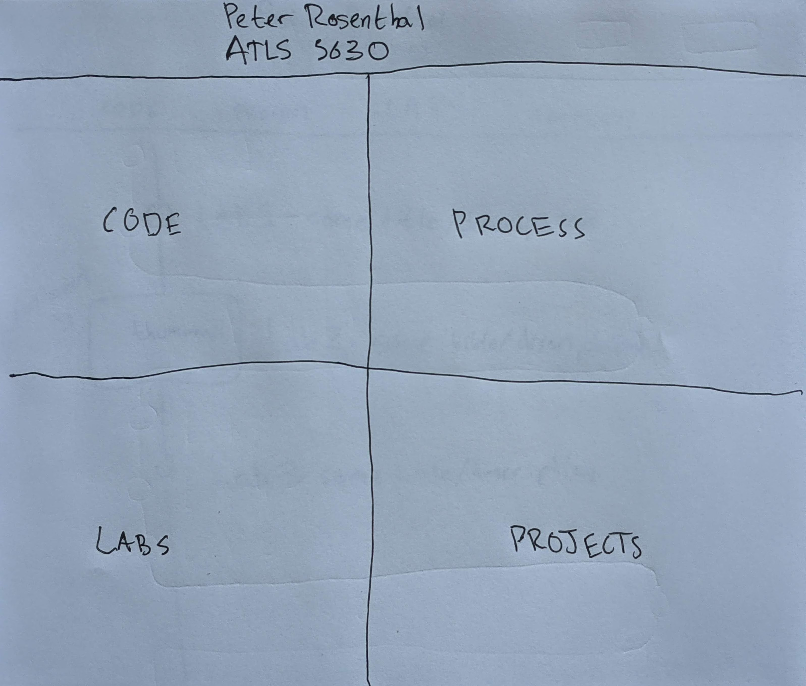

# Class Portal Process
## Milestone 1
The main theme/concept that I want to follow with my portal this time was to have some sort of timeline aesthetics going on. I haven't done a timeline style portal/portfolio before, though I've seen it done a couple times online when looking for inspiration. I think that once the class is finished a timeline is a great way to showcase how my skills have improved throughout the semester. One convenient thing about timelines is that they can be turned vertical and fit on small mobile screens really easily, which allows for the visual design to not be compromised in order to reach responsiveness, the responsiveness is inhernent to the design from the beginning. The first thing I did was create a sketch wireframe to get my concept ideas out onto paper.

This resulted in my first wireframe, which isn't the design I will be going with in the end, but it was still super important and helped me eventually arrive upon my final design.

This first wireframe sketch has a header with my name and the class name on it as well as two buttons, one to my process (these journal style process entries) and one to my code for the class. And then below the header in the main body of the page there is one big timeline that has centered text, but moves the line to the left side for labs and to the right side for projects. This idea was mostly to keep the page looking interesting, but would also serve as a quick way to distinguish between labs and projects. Unfortunately (or fortunately) I went back and read the description for the assignment and saw that a single page portal wouldn't cut it, and I needed separate pages for labs and projects; I couldn't combine them onto one timeline.

So I created a second design, one that needed two wireframe sketches in order to show off the multiple pages of the class portal.

This new design features a header with no links at all other than taking the user back to the landing page if they so desire. But then a secondary nav header that only appears on the labs and project pages, not the landing page. This nav header contains external links to the code and proecess like the first design's header had, but also internal site links to the labs page and the projects page. The landing page has all the same links as the nav header does on not the landing page, but they are spread out to take up the whole page in a grid and have fancy image backgrounds to make them look pretty (I was unable to draw these backgrounds in my sketch). The labs page and the the projects page are identical other than one contains labs and one contains projects, so I only drew a wireframe for the labs page because the same wireframe applies to the projects page as well. These pages contain the timeline like the very first design, but the line sticks to one side because there's no need to differentiate timeline entries anymore. This timeline design also has a feature where the timeline entry being hovered over expands to show a thumbnail of the lab or project to add more fun and interactivity.

One thing that I was not able to communicate with my pen on paper sketches is the colors that the site will be using. For now I want to stick with a light background to the whole site, though maybe a 'dark mode' could be developed and added on later, people love that little switch to go into dark mode. But other than the light background I want very colorful accent lines throughout the page. I'm color deficient and usually find it hard to pick colors myself that look good to both me and normal people, so lately I've been relying on generative color schemes as those tend to work for most everyone. To generate the color scheme for this site, I went to [coolors.co](https://coolors.co/), my favorite color generating site, and just generated away until I felt inspired by something. I then went and modified it very slightly just to make it a little bit more attractive of a color palette, and now these are the colors I'm going to use in the site!

Just one last note on responsiveness: like I mentioned earlier in this proecess entry, the vertical stack that is core to my design makes responsiveness inhernent to the design, and it should look the same, or at least look as intendid no matter the screen size. To really make sure that this happens in practice, not only theory, this is going to be my first site where I actually design for mobile first. Then if there are any changes that I need to make to adjust the design to bigger screens then I can do that, but my goal is to have the two designs (desktop vs mobile) as identical, not only in visuals but also in code, as possible.

