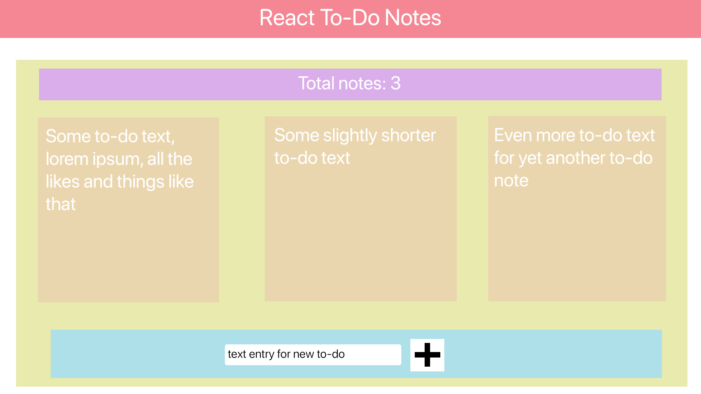

# Lab 7 Process
## Mock-up and Component Heirarchy

For my to-do list app, I decided I wanted to go for a bit of a sticky-notes type of aesthetic. It might not be clear that that's the aesthetic I'm going for from the mockup above though, because the visuals and colors of the mockup are intended to separate out the components for planning purposes rather than to indicate the final aesthetic that the app will have. Since the colos of the mockup are more functional than aesthetic, here's the main run-down on the function of each color:
  * **RED - TitleBar**: the title bar component will be responsible for holding onto a simple h1 title for the page. The title text will be centered in the title bar, and the bar will take up the whole width and have its own colors and everything. The title bar component will be a direct child of the main app component, and there should only be one per app.
  * **YELLOW - ToDoList**: the to-do list component will be the parent component that holds on to the list of to do entries. From a data perspective these entries will be stored within the to-do list component as an array of strings, and from a UI stand point the entries will be rendered as their own child components of the list. The to-do list component will be a direct child of the main app component, and there should be one per app.
  * **PURPLE - ToDoTotal**: the to-do total component will take care of rendering the total number of entries in the to-do list. This component won't have any other interactivity, just data flowing down into it. The to-do total component needs to be a child of the to-do list component in order for data to flow down properly, and there should really only be one to-do total component in the entire app.
  * **ORANGE - ToDoEntry**: the to-do entry component will render a single entry of the to-do list, and handle the functionality of deleting said entry from the list upon being clicked. The functionality for deleting an entry can be achieved using the "lifting state up" method. All to-do entry components should be children of the to-do list component, and there can be as few as 0 and as many as the user's computer has RAM for.
  * **BLUE - NewEntry**: the new entry component will have a single text entry input field and a button. Upon the button being pressed (as long as the text input isn't empty) a new entry will be added to the to-do list component with the contents of the text input being the contents of the entry. The text input then needs to reset so that the new entry component is ready to add yet another new entry to the list. The new entry component needs to be a child of the to-do list component for the data flow to work properly using the "lifting state up" method of defining the function that handles the event in the parent (to-do list component) and passing it in as a prop to the child (new entry compontent). And there should only be one new entry component per app.

## Minimal State Representation
The mock-up and component hierarchy does a pretty good job of describing the over all data flow architecture of the app, but just as a quick recap: there are only two pieces of data in this app that are coponent state:
  1. The array of strings containing the to-do items is state data in the ToDoList component.
  2. The contents of the text input for new to-do items is state data in the NewEntry component.

## Static React App

