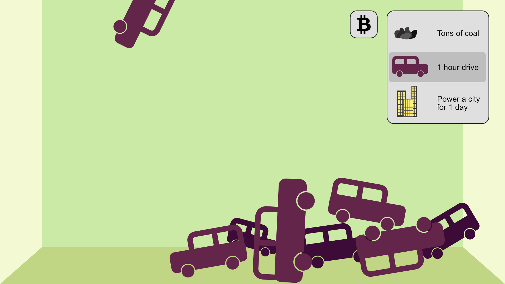
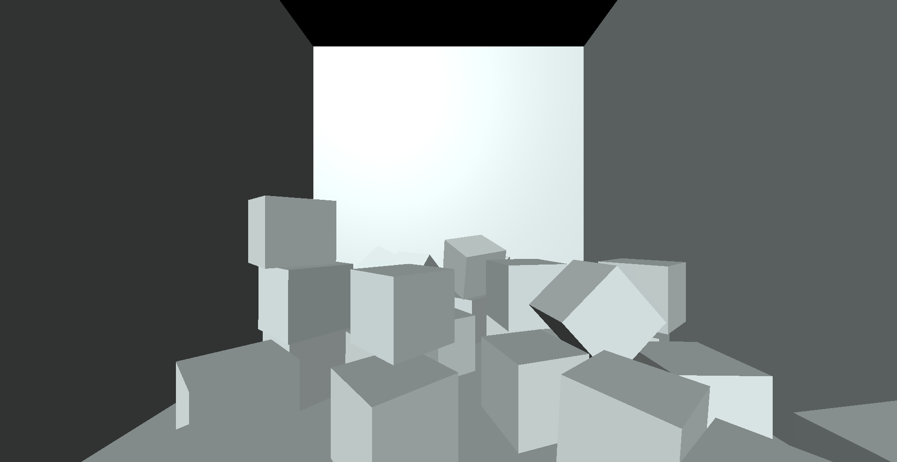

# Project 1 Process
## Milestone 1
### Project Overview
I'm not the biggest fan of cryptocurrencies overall. Don't get me wrong, I have nothing against the general idea of crpyto, I think it's fine. But I'm not a fan of how the concept of proof of work is absolutely integral to cryptocurrencies functioning at all. And proof of work is a problematic concept environmentally, as there's no way around using electricity to prove such work. This is why you might hear on the news about massive "mining" farms, essentially full power datacenters and supercomputers, chugging through cities worth of electricity per day, all in the name of pulling these coins out of thin air. To be clear, not all cryptocurrencies are created equal, and some people involved in crypto are certainly more environmentally concious than others. There are cryptocurrencies that require a fraction of the energy usage for mining as others, which should be good in theory, but it turns out that mining farms tend to use the same ammount of energy in those cases and just mine more. There are also sometimes mining farms that claim to only be using renewable energy to mine their coins, which once again sounds great except when you look deeper, there are very few places in the world where renewable energy is in so much excess to support mining farms, and these mining farms usually aren't there. That means that even renewable energy miningy farms are most of the time taking away renewable energy that could have gone to normally supporting the human population, so their contributing to the same increase in coal electricity emissions regardless of if they are running on renewable energy or not. Such mining operations might eventually become sustainable, once renewable energy is actually widespread adopted and in excess in their area, but for now they aren't. It seems like most people who are really interested in crypto will respond to environmental concerns with similar future promises, but the world and the environment can't wait for future promises, changes need to happen now.

All this is to say, I want to center the topic of my project on education about how bad for the environment investing in and using cryptocurrencies can actually be, *right now*. My goal is to make an interactive data visualization experience where the user can pick a measurement to measure emissions by, as well as a cryptocurrency to measure. A 3D object of that measurement will then fall from the top of the screen at the rate that the selected cryptocurrency is emitting CO2, as measured by the rate that crypto is traded/mined globally, and the per-trade/per-mine emissions. The data for that will mostly have to come from static numbers I can find through [online research](https://news.climate.columbia.edu/2021/09/20/bitcoins-impacts-on-climate-and-the-environment/), but there is a chance that some API will be used to some level (as discussed in part 3 of this milestone). My goal is to keep the measurment units fun, but also include some very easily understandable ones too. Some example measurments would be: tons of coal (simple), 1hr drive (relatable), and power a city for a day (impactful).
### Wireframe

In this mockup, the box that the measurements are falling into takes up the whole screen/viewport, and cars (the currently selected measurement) are falling from the ceiling. In the top right corner, overlaying the 3D scene, are two selectors: one for the coin to measure, and one for the measurement to use. Currently the coin selector is collapsed and the measurement selector is expanded (this is just to show how the two different states would look).

### API/Javascript Library
My main goal for this project all along actually has been that I wanted to be learning the library [THREE.js](https://threejs.org/) and creating something with that. I kinda came up with what library I wanted to use before I came up with the topic, and the topic has just been an excuse to learn THREE.js all along. I've been wanting to learn THREE.js for almost a year now, but haven't had a good reason to up until now. So I've gone through and read the "getting started" section of the [official documentation](https://threejs.org/docs/index.html#manual/en/introduction/Creating-a-scene), and then skimmed the rest of the documentation to get a good idea of the classes, but I have yet to create anything with this knowledge that I've been trying to acquire, so I'm looking forward to putting it to use. I also mentioned I might use an API or two earlier in this milestone, one of the APIs resources given to us for Lab 5 has a lot of cryptocurrency related APIs. At first this concerned me due to my general distaste of crypto (as mentioned earlier), but then it gave me the inspiration to do something about it, and that's what inspired my project topic to begin with. So I bet somewhere in that [list of 40 or so crypto APIs](https://github.com/public-apis/public-apis#cryptocurrency) I'll be able to find some live/real-time trading and/or mining data, and I can probably use that to feed the visualization rather than some static fixed number I come up with from online research.

## Milestone 2
### Minimum Viable Product
Last milestone I mentioned that most likely I would be using hard data, though there's a chance I might include some level of real-time crypto data from one of those APIs. When deciding what does and doesn't make it into the MVP though, I think those APIs are the first thing to go. They're very optional, and I already have several sources from the internet that I can draw upon for hard data (the one linked in the last milestone, and [this one](https://medium.com/tqtezos/clean-nfts-on-tezos-58566b2fdba1) which seems even better... though also maybe a little biased). At minimum, I want to include 3 different crypto currencies, bitcoin, etherium, and tezos, that the user can choose from with a selector input. As well as I want at least 3 different measurment values, the three mentioned in the previous milestone, but hopefully I can exceed the MVP a little, and have time to add even more ways/objects to measure carbon output with (this is going to be the first area to be expanded upon after the MVP if time permits). Neither of these selectors have been implemented into the work in progress website yet however, because they are much simpler than learning two new libraries (that's one more than I was initially intending on doing), so I started with the hard part: learning THREE.js (... and cannon-es too)!
### Development Process
The first thing I did for the development process is set up my node development environment for this project. I could go node-less and just use a CDN to deliver my needed libraries, but I have this fear with CDNs where the CDN is going to go down some unknown years into the future, and I have to go and update my otherwise perfectly fine project just in order to get it working again, that is if I even know that my project has broken. I know that it's pretty much impossible to make these kinds of web applications last forever, just look at what happened to flash a year ago now, but I do feel like I'm a little step closer to permanence if I use npm to manage my packages, and a bundler like webpack to bundle the library into my code outright. This does mean that you wont be able to read the code with just inspect element in a web browser, you'll instead have to read it [here in my git repository](../../code/project-1/)! And the final addition I made to my development environment was to add typescript as well, I figured if I'm already using a bundler and have to wait on that to do it's job after saving, then the compile step from typescript to javascript adds pretty much no extra hassle, for all the extra benefit. When I'm coding with typescript instead of javascript I feel like I have super powers, but really it's just my IDE and typescript working together to make the development experience so much more smooth, and it makes learning a new library or two so so much easier in my opinion.

So finally, what is all this talk about two new libraries when last milestone I said the only new library I had to learn for this project was [THREE.js](https://threejs.org/)? Well I kind of forgot about slash overlooked the fact that THREE.js has nothing to do with physics at all, only rendering, and my entire concept of "things bouning around in a box" required a basic physics engine running in the background for this. And a "basic" physics engine is nothing but basic, especially in 3D, and that's nothing I'd like to code up at all. So I naturally just turned to the most popular physics library used along side THREE.js, [cannon-es](https://pmndrs.github.io/cannon-es/)! Cannon-es's entire interface is even heavily inspired by THREE.js's interface to make working with the two of them along-side each other as easy as possible.

So after sufficient reading of the THREE.js and cannon-es documentation, I dove right into creating a prototype/proof of concept for the project that would eventually just upgrade and morph into the project itself. I started with the "box" that things would drop into, and I made it out of 4 planes enclosing the bottom of the screen, the two sides, and the back, but leaving the front open for the camera to look into, and the top open for the objects to drop in from. Then I got to work simulating the physics and adding some cubes spawning at random places along the top of the box every second. These cubes fall down and bounce around in the box a bit, and they'll eventually be replaced by 3D models of the measurement objects that the user will select in the soon-to-be-implemented select box for measurements. And the fixed 1 second spawn rate will soon enough be replaced by the respective carbon burning rate for the crypto currency from the soon-to-be-implemented select box for cryptos. You can check out this milstone live on my [class portal](https://creative.colorado.edu/~pero7021/fwd/projects/milestone2/project1/) though be warned: the cubes dropping from the sky never end, and so performance gets out of hand if the browser window is left open for too long.
