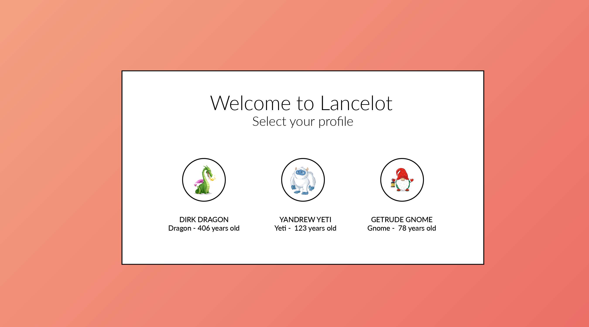
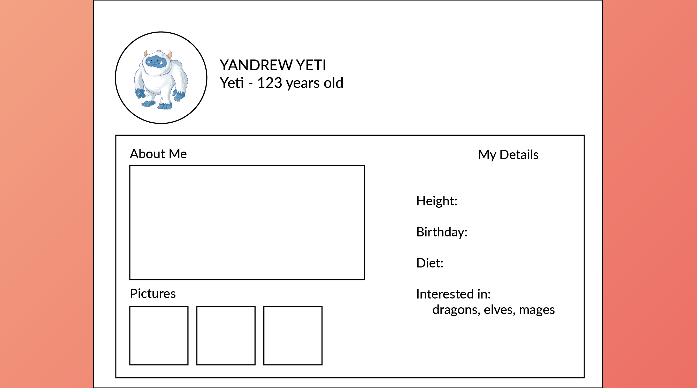

# Project 2 Process
## Milestone 1
### Project Overview
For this final project, we plan on doing something a little bit more lighthearted and silly. Not only does it make it something that's fun to present during an otherwise stressful finals time, but it also makes it a lot easier to work on too, the silly vibe can really reduce the pressure of the project for everyone which is nice. So the silly thing that we want to create is a little game/game-like experience called *Lancelot*. *Lancelot* is a dating app for monsters, mages, and all things mythical!
We want to start with just focusing on the profile creation experience. If we really have the time then we would love to take the project even further, but we want to keep the project responsibly scoped so that we don't overwhelm ourselves.

### Content Sources
We aren't really planning on using any outside content for this project. We might have to source some images from the internet to speed up the development process. But other than that, the rest of the project is going to be 100% birthed out of our own creativity. And even the images is something that we'd love to create ourselves if we end up having time to!

### Visual Design: Mockup/Wireframe

Our mockups for this project shows two separate "pages" but we are creating a single page application, so these should actually be thought of more as two separate "views" of the application. We shouldn't need to do any routing or anything special, because the user should never even need to navigate back and forth between the views: they are sequential views, not parallel. The first view has only one choice that needs to be made, and then the second view will load upon the completion of that choice (different versions of the second view are loaded depending on what choice was made in the first view). The first view is where the user select's their character for this game-like experience. In our mockup we are giving the user a choice between "Dirk Dragon," "Yandrew Yeti," and "Gertrude Gnome" as their characters, our goal by the end is to have designed a bunch of different characters, and randomly select 3-4 from the list to let the player chose from at this stage. Then once a character is chosen, the player moves on to the second view of the little game-like experience where they "fill out" their dating profile. Like mentioned in the project overview, we want to throw some light quips at social media/dating apps in there while where at it, and so rather than pressuring the user to come up with creative dating profiles themselves: we will have them merely pretend to fill out the profile, but instead fill it out with our own predetermined content for the user to read and laugh at.

### Team Members
For this project, Bella Colosimo and I are partnering up. We never really worked together when we were undergrads in the ATLAS program, but then since we both moved onto the graduate program, we've worked together a lot, because we've been able to leverage our shared past and combined knowledge. We form a pretty consistent/predictable team, and we know well how we work with each other because we've done it numerous times in the past by now. We don't usually dictate out any roles or leadership on our team, and we both often times have a lot of overlap in what we do... which is everything, so we kind of both do everything together, from both the design and production stand point. I do have slightly more experience in coding and Bella has more experience in design, so we do have our respective strengths and weaknesses that we can play to, but I have found in the past that the two of us tend to rely more on direct collaboration than we do on dividing and conquering.
