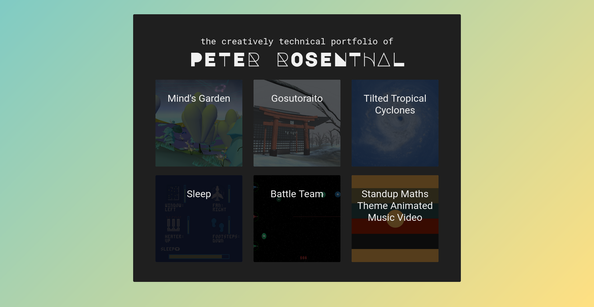
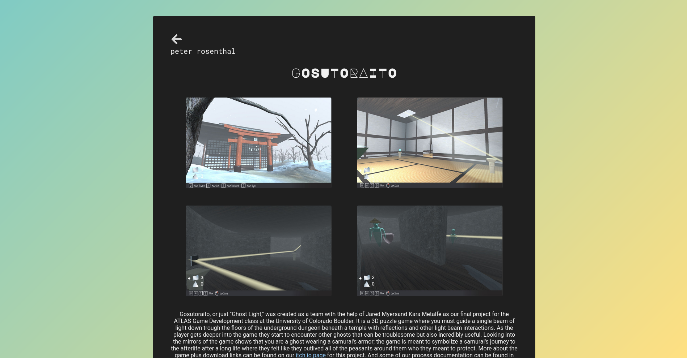
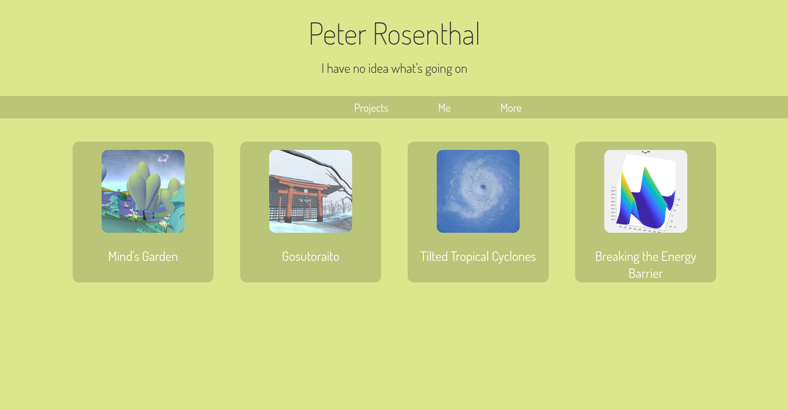
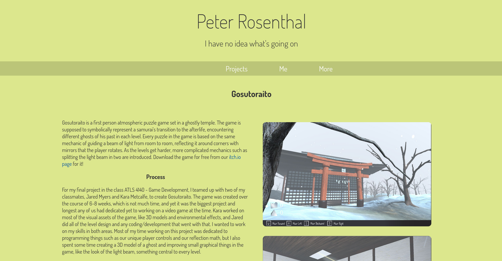
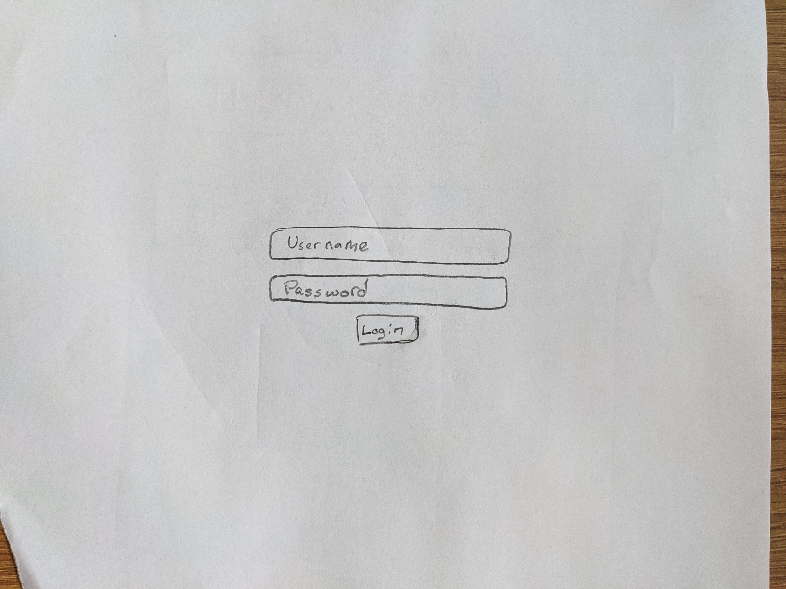
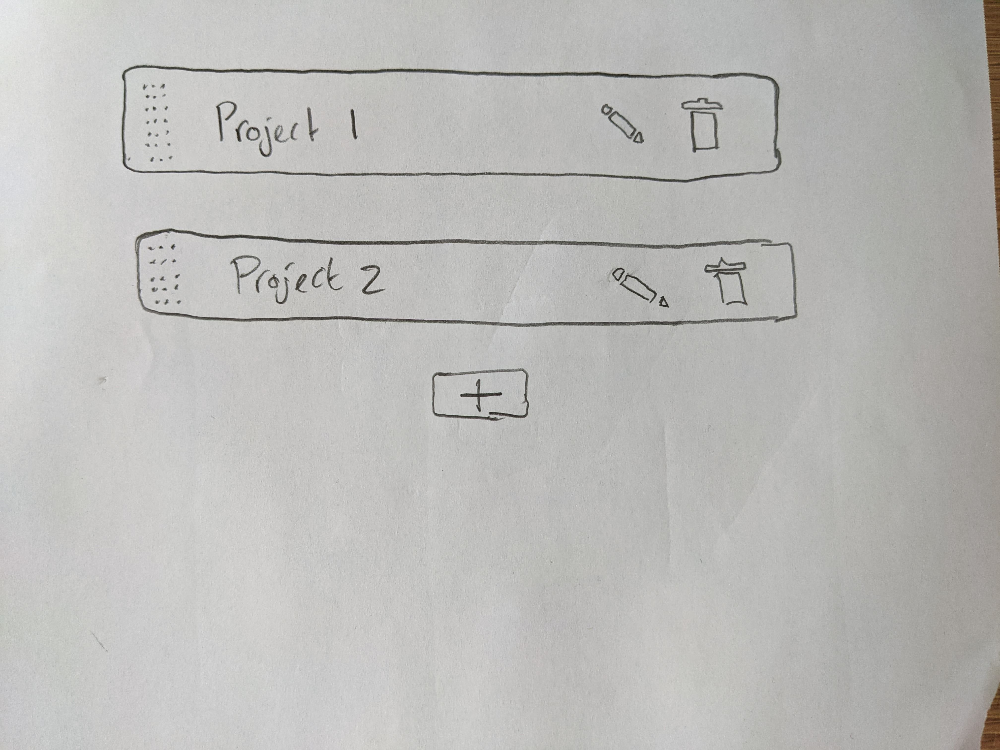
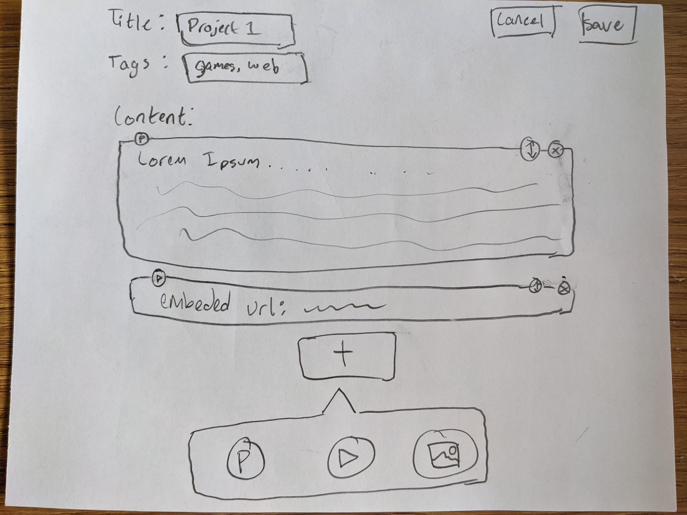
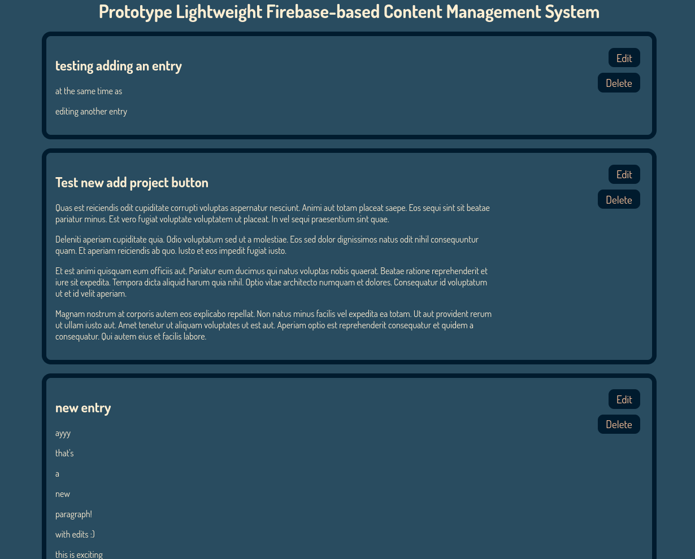

# Project 3 Process
## Milestone 1
### Project Overview
I'm calling the additional project that us graduate students have to do 'Project 3' just because that feels more organized to me for some reason, even though this whole project comes before 'Project 2' (I just want to keep that project number consistent between me and the undergrads). Anyways, one of the main goals for Project 3 is for it to be related to our main fields of study as a grad student. Unfortunately I feel super uncertain about my field of study, I like everything development related, and my number one priority in grad school right now I feel is just to prepare myself as much as possible for a successful creative software development career. I currently have a good amount of projects in the last 2 years that I have documented (and saved that documentation really quite well), but I haven't published any of it to my portfolio because my current portfolio website for creative technology work is really bad. So bad that I haven't bothered to update it since getting into grad school. Like I mentioned earlier, I've been just saving and holding on to the documentation for all of my grad school projects so far, waiting until I had an adequate portfolio to put them in. My current (really bad) portfolio can be found at [peter.rosenth.al](http://peter.rosenth.al), though hopefully not for too much longer because by the end of this project my new portfolio will be hosted there, so I might as well start calling it my "old" portfolio even though it's the one that's currently deployed at the time of writing this. Here's some screenshots from that portfolio so you can understand what I'm talking about even once it's taken down:

I tried fixing this about a year ago, and as my final project for ATLAS Professional Seminar, I took it upon myself to learn the Svelte framework for front-end web development, and build myself a fancier and much more readable portfolio. I put a lot of effort into this newer portfolio both creating a new design and also creating much more high quality write-ups about the projects. And that effort payed off with what's in my opinion a really nice looking portfolio with also really nice writing about the projects. But because Svelte is designed for just single page applications, I had a hard time getting the actual navigation of my site to be accessible and intuitive. The browser back and forward buttons wouldn't do anything because there were no real pages to move back and forth between, and for that same reason I also had no way of linking a specific portfolio entry to someone, because there was only ever one page to link to. I never felt comfortable publishing/deploying this website to my actual portfolio domain, so it's been hidden away all this time on a sub-page that has no links going to it: [peter.rosenth.al/dev](http://peter.rosenth.al/dev/). Once again, like my other older portfolio talked about in the first paragraph, this version of the portfolio is likely to be un-deployed soon and taken of the web once I finish this project, so here's some screenshots of the same respective pages as before:

My goal for this project then is to learn myself some SvelteKit, a server side rendered multi page web application framework being built on top of the Svelte SPA framework, and use that to build a portfolio worthy of lasting years, possibly even decades. Using SvelteKit instead of Svelte will solve my navigation issues I had with my last portfolio that I never fully "realeased." And now that I know how to use Firebase thanks to this class I can get started on one of the most important aspects to keeping a portfolio up to date for years to come: a content management system. I know a lot of people *really* don't like the idea of writing your own CMS, it's like re-inventing the wheel. But I want to keep my own CMS as light as possible and purpose built to my needs here, so re-inventing the wheel here shouldn't be the worst undertaking in the world, and I think the benefits will outweigh the costs. I also would like to start prototyping my CMS in Lab 6 of the class, which I hope is okay from a double-dipping stand point because my project as a whole is *much* more than just a CMS.

### Wireframe
As for a wireframe, I hope it's okay if I don't include one for the main part of the portfolio site. I plan on the design being an iteration upon my previous portfolio ([peter.rosenth.al/dev](http://peter.rosenth.al/dev/)). And the interaction flow will be very similar to that pre-existing interaction. So that site serves for me as something even better than a wireframe: a fully functional prototype (save for a few plans like removing the "more" tab).

I do still need (and have featured below) a wireframe for the CMS part of the site however, as that is something that would be a completely novel design for me, not iterative. The user (me) would access the CMS page by going to a sub-page url of my main domain that doesn't have any other pages linking to it, it's a "ghost" page, it'll probably be something like peter.rosenth.al/admin. That page will ask for a log-in which uses the Firebase auth services to authenticate a user. Once authenticated as me (or anyone else I give permission to edit my portfolio, which I'm not sure if I ever would), I can then access a UI where I can select existing portfolio entries to edit them, or create a new entry. When I'm editing or creating an entry I'll have an editor kind of inspired by WordPress or Wix, where I can sequentially add blocks of either text, embeded YouTube video, or images. Fancier and more developed out services also have a lot more than just those options, but that's all I'll need, so in the name of keeping the CMS as lightweight as possible, that's all I'll include. Things like paragraphs and video links can be stored directly in Firebase Firestore, whereas images will have to be uploaded to Google Cloud storage (luckily I already have plenty of experience with GCS from my job), and then the link to the image on GCS can be stored in Firestore with the rest of my information.

## Milestone 2
### Minimum Viable Product
For my minimum viable product, I want to separate it down to the two major user groups that will be using this product (my portfolio website). Group 1 is the regular users who will be browsing my site, looking to read about the projects I've worked on. This group could include my potential employers, coworkers/peers, or just random people on the internet looking to know more about me I guess. And group 2 is the "administrator" user(s) who are looking to update the contents of the site, change old portfolio entries, add new portfolio entries, etc. This group consists of me, and just me for now.

The MVP requirements for group 1 are as follows:
- A sleek and fun portfolio that screams "hire me" in it's interactions
- Accessible and functional for all: follow POUR guidelines, and no alt text is left behind
- All old portfolio entries (all my entries as of this time last year) included for now. Newer ones can be added soon after the MVP through this website's functionality for group 2.

Which is the perfect transition into the MVP requirements for group 2:
- Ability to easily add, remove, and edit existing content: paragraphs, images, and embedded videos
- It's important that this process is as easy as possible, because the barrier for entry to keep this portfolio up to date with content needs to be low so that I always keep it up to date as quickly as I can
- That's just it really, it needs to be easy to keep up to date... also secure too...

### Development Process
I was feeling pretty confident about the first and third MVP requirements for group 1, as I already put in a ton of time and effort into them a year ago when I tried creating a [portfolio in Svelte](http://peter.rosenth.al/dev/), but never deployed it. I think that portfolio did a great job on those two things, but I never deployed it because it totally fell flat on it's face in terms of the second MVP requirement for group 1 and all of the MVP requirements for group 2. I never deployed it because I knew it was destined to fail because of what it was missing. Now with this project, I am confident that with a rewrite from scratch that took accesibility into consideration from day 1 in the code base, as well as transitioning from Svelte to SvelteKit, would solve all of my needs for group 1. So for my development process for up to milestone 2, I decided to focus entirely on meeting the needs of group 2.

I started out thinking that I would satisfy my needs by creating a lightweight/mini content management system that was based on firebase to store all the information. I even outlined a relatively detailed amount of how I intended on accomplishing this in Mileston 1 of this project's process log too. The first thing I said I was going to do was to start prototyping this firebase-based CMS in normal JavaScript/ES6 for Lab 6 of this class. And I ended up creating an entire fully functional mini-CMS that allows for entries to be created, updated, and deleted, and the entries all contained a title and any number of paragraphs. That lab assignment can be [explored here](https://creative.colorado.edu/~pero7021/fwd/labs/lab6/), though I intend on disabling the access token at the end of the semester for security reasons, which will render that lab assignment unusable at that point.

And that note about security leads me to why I decided to switch directions within the last 30 hours and stop working on any custom firebase content management alltogether. For this milestone I was originally hoping to have translated my work from Lab 6 from vanilla JavaScript to Svelte, and include all the lesson's I had learned along the way. But I started to think about the API key, and the security implications that come along with it, and I started to get worried. The easiest way to use an API key (especially as a front-end developer) is to just include it in the code. But since the code needs to be exposed to the browser in order to run, litterally anyone can just scan the code with inspect element, and find the API key and use it themselves, essentially billing me for their own project. I don't want such large holes in the security of a website that I want to be deployed for a long long time, especially not a website that represents *me* as a person. I started looking into other ways of holding onto API keys, but all of them required me to know a lot more about back-end web development than I do, and I need this code to run on various different servers and in various different environments that I don't necessarily have control over. So I eventually decided just to abandon API keys and firebase alltogther.

What am I replacing it with? Well... literally just Google Docs! I'm pretty excited about this because I already write all of my portfolio entries in Google Docs anyways, and now I can just pull from those documents as data sources directly. I recently (again, all of this happened in the last 30 hours) discovered [ArchieML](archieml.org), a markup language that is incredibly non-monospace format friendly, that can be parsed into regular JSON data using an npm package, and that JSON data can then be held on to locally on the machine I am hosting my website on, and drawn upon in the SvelteKit code to be rendered into a webpage. So with this workflow, all I would need to do to add a new portfolio entry is to add some light markup to my portfolio entry in the Google Doc, then make it publicly readable, but not publicly editable, and then copy and paste the Google Doc's ID string from the url into my website's "Google config" file, and finally upload my updated config file to the server! I guess that is a whole 4 steps, but that's 4 pretty easy steps that require literally no coding at all, so I consider that barrier to entry to add new portfolio entries to be very low! And all I need to do to remove a document is to remove it's ID from the config file, and again push the new config file to the server. And updating the contents of an entry is the easiest, because all I have to do is literally just update the words in the Google Doc, and it will change on the website automatically!

Now... because I just discovered this workflow and ditched my old firebase-CMS idea in the last 30 hours, I really wish I had a functional mockup or something to share at this time, but I literally just started prototyping this new workflow so recently, and I have nothing to show. I'm not even sure I will have much to show for this workflow in the end, because it's much more "behind the scenes" than my old CMS idea was. But I'm really looking forward to it, because I think on top of being more secure, it'll also be even easier to update the content than my old CMS idea I think. Once I get this content workflow settled in the next few days, I can get right into building a website around the content workflow, and I think I'll be back track as far as the timeline is concerned in no time.
