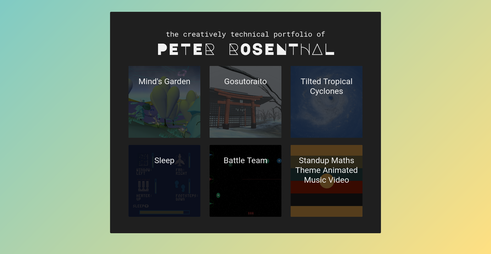
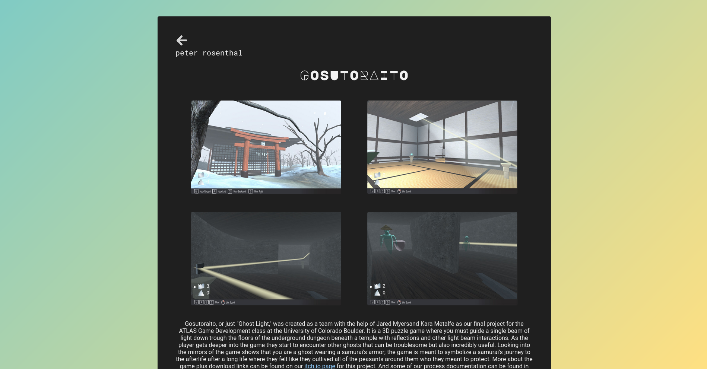
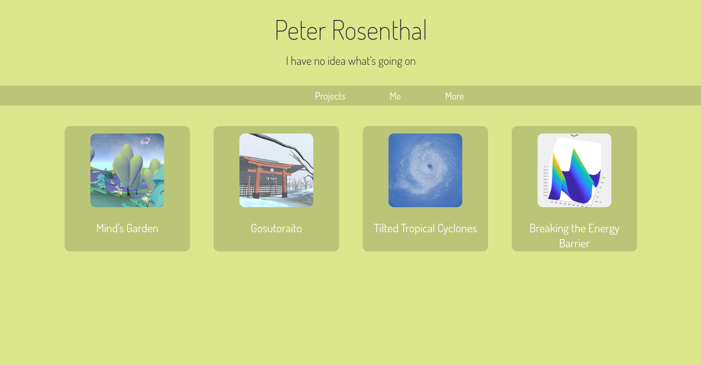
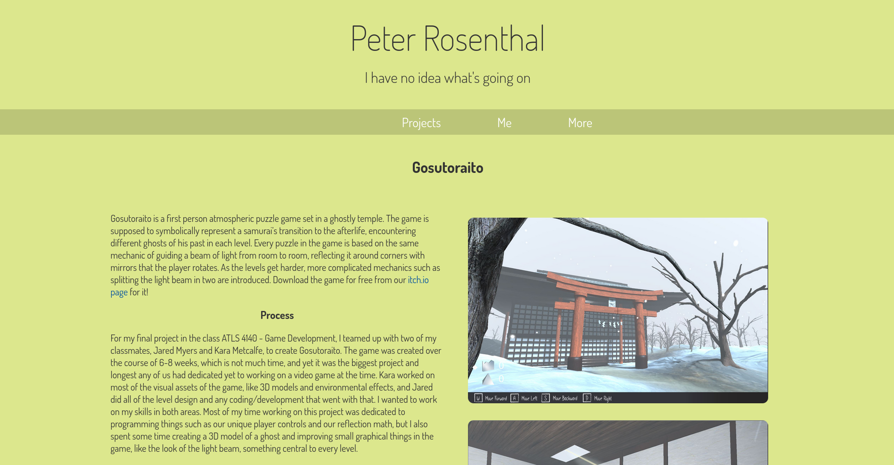
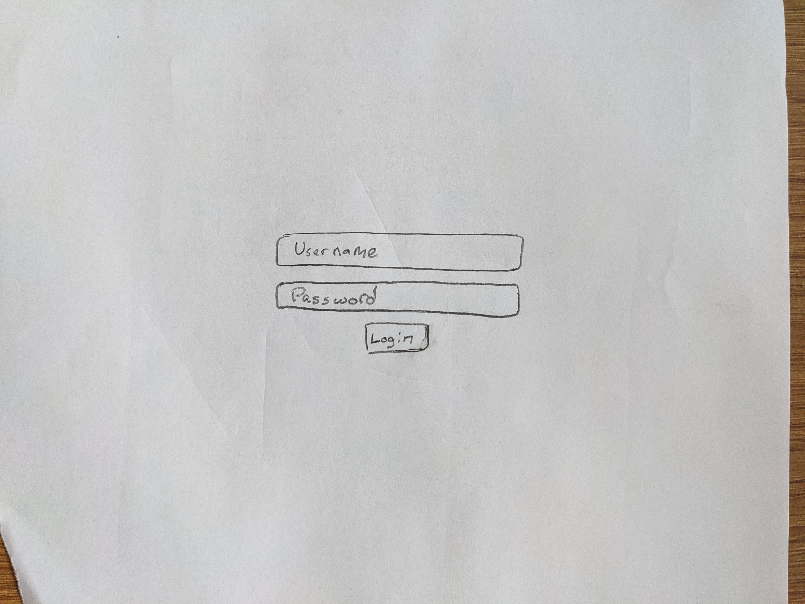
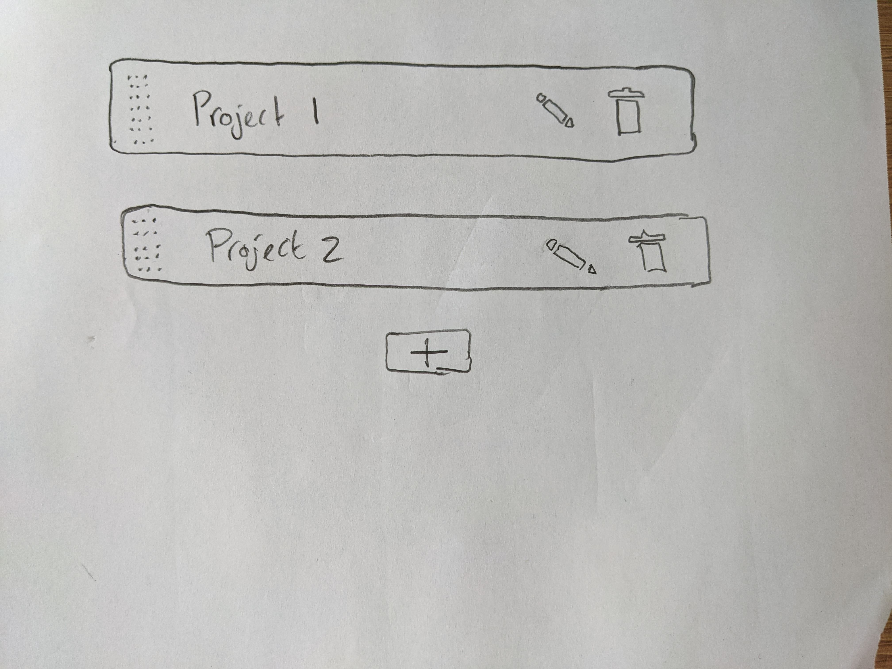
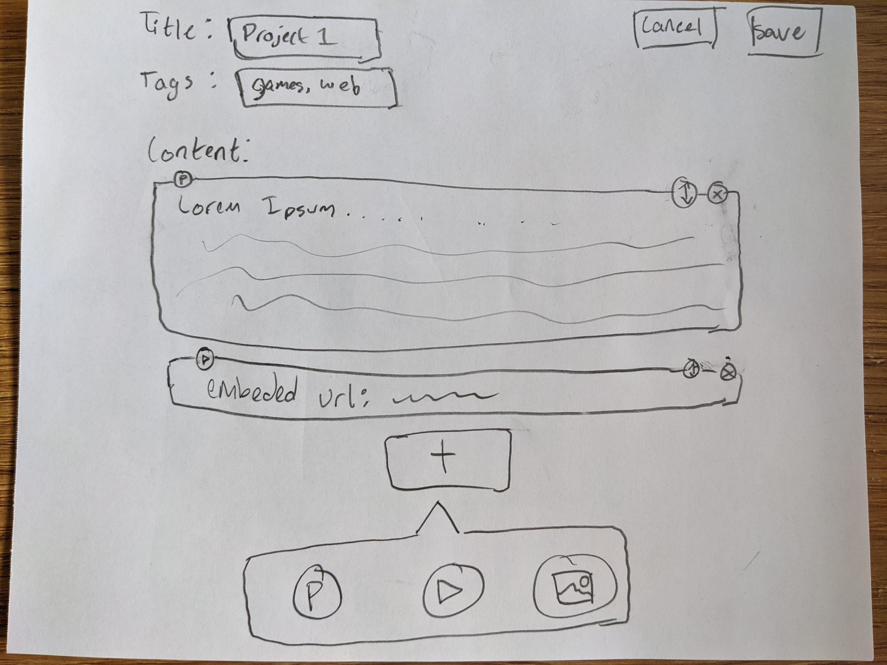

# Project 3 Process
## Milestone 1
### Project Overview
I'm calling the additional project that us graduate students have to do 'Project 3' just because that feels more organized to me for some reason, even though this whole project comes before 'Project 2' (I just want to keep that project number consistent between me and the undergrads). Anyways, one of the main goals for Project 3 is for it to be related to our main fields of study as a grad student. Unfortunately I feel super uncertain about my field of study, I like everything development related, and my number one priority in grad school right now I feel is just to prepare myself as much as possible for a successful creative software development career. I currently have a good amount of projects in the last 2 years that I have documented (and saved that documentation really quite well), but I haven't published any of it to my portfolio because my current portfolio website for creative technology work is really bad. So bad that I haven't bothered to update it since getting into grad school. Like I mentioned earlier, I've been just saving and holding on to the documentation for all of my grad school projects so far, waiting until I had an adequate portfolio to put them in. My current (really bad) portfolio can be found at [peter.rosenth.al](http://peter.rosenth.al), though hopefully not for too much longer because by the end of this project my new portfolio will be hosted there, so I might as well start calling it my "old" portfolio even though it's the one that's currently deployed at the time of writing this. Here's some screenshots from that portfolio so you can understand what I'm talking about even once it's taken down:

I tried fixing this about a year ago, and as my final project for ATLAS Professional Seminar, I took it upon myself to learn the Svelte framework for front-end web development, and build myself a fancier and much more readable portfolio. I put a lot of effort into this newer portfolio both creating a new design and also creating much more high quality write-ups about the projects. And that effort payed off with what's in my opinion a really nice looking portfolio with also really nice writing about the projects. But because Svelte is designed for just single page applications, I had a hard time getting the actual navigation of my site to be accessible and intuitive. The browser back and forward buttons wouldn't do anything because there were no real pages to move back and forth between, and for that same reason I also had no way of linking a specific portfolio entry to someone, because there was only ever one page to link to. I never felt comfortable publishing/deploying this website to my actual portfolio domain, so it's been hidden away all this time on a sub-page that has no links going to it: [peter.rosenth.al/dev](http://peter.rosenth.al/dev/). Once again, like my other older portfolio talked about in the first paragraph, this version of the portfolio is likely to be un-deployed soon and taken of the web once I finish this project, so here's some screenshots of the same respective pages as before:

My goal for this project then is to learn myself some SvelteKit, a server side rendered multi page web application framework being built on top of the Svelte SPA framework, and use that to build a portfolio worthy of lasting years, possibly even decades. Using SvelteKit instead of Svelte will solve my navigation issues I had with my last portfolio that I never fully "realeased." And now that I know how to use Firebase thanks to this class I can get started on one of the most important aspects to keeping a portfolio up to date for years to come: a content management system. I know a lot of people *really* don't like the idea of writing your own CMS, it's like re-inventing the wheel. But I want to keep my own CMS as light as possible and purpose built to my needs here, so re-inventing the wheel here shouldn't be the worst undertaking in the world, and I think the benefits will outweigh the costs. I also would like to start prototyping my CMS in Lab 6 of the class, which I hope is okay from a double-dipping stand point because my project as a whole is *much* more than just a CMS.

### Wireframe
As for a wireframe, I hope it's okay if I don't include one for the main part of the portfolio site. I plan on the design being an iteration upon my previous portfolio ([peter.rosenth.al/dev](http://peter.rosenth.al/dev/)). And the interaction flow will be very similar to that pre-existing interaction. So that site serves for me as something even better than a wireframe: a fully functional prototype (save for a few plans like removing the "more" tab).

I do still need (and have featured below) a wireframe for the CMS part of the site however, as that is something that would be a completely novel design for me, not iterative. The user (me) would access the CMS page by going to a sub-page url of my main domain that doesn't have any other pages linking to it, it's a "ghost" page, it'll probably be something like peter.rosenth.al/admin. That page will ask for a log-in which uses the Firebase auth services to authenticate a user. Once authenticated as me (or anyone else I give permission to edit my portfolio, which I'm not sure if I ever would), I can then access a UI where I can select existing portfolio entries to edit them, or create a new entry. When I'm editing or creating an entry I'll have an editor kind of inspired by WordPress or Wix, where I can sequentially add blocks of either text, embeded YouTube video, or images. Fancier and more developed out services also have a lot more than just those options, but that's all I'll need, so in the name of keeping the CMS as lightweight as possible, that's all I'll include. Things like paragraphs and video links can be stored directly in Firebase Firestore, whereas images will have to be uploaded to Google Cloud storage (luckily I already have plenty of experience with GCS from my job), and then the link to the image on GCS can be stored in Firestore with the rest of my information.

